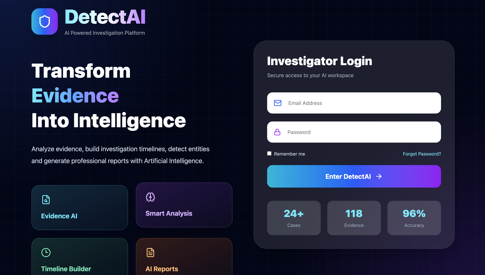
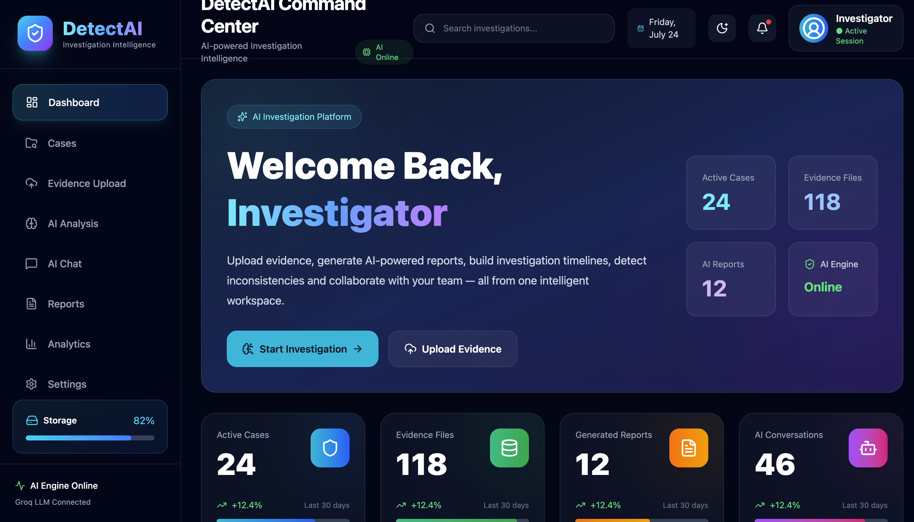
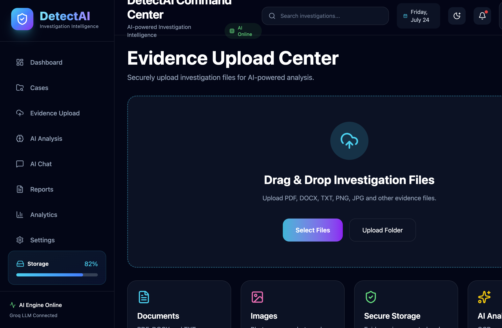
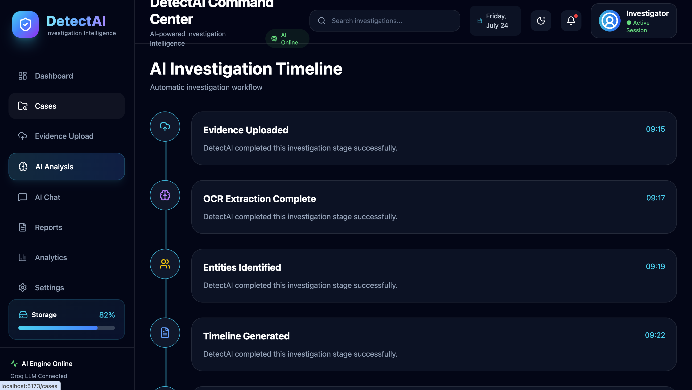
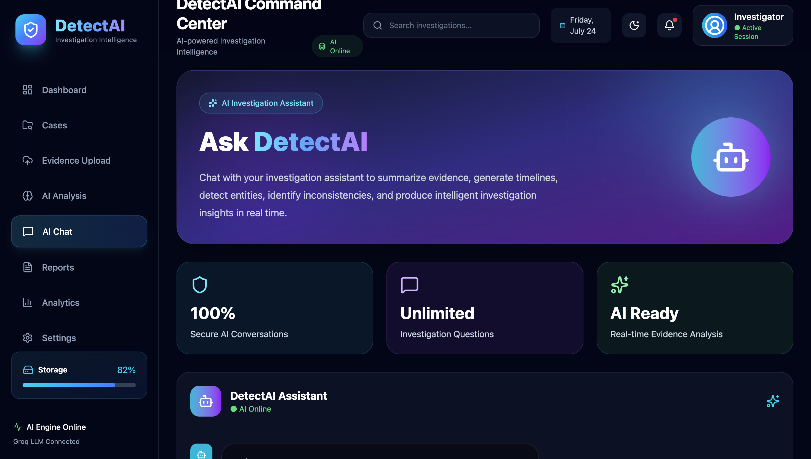
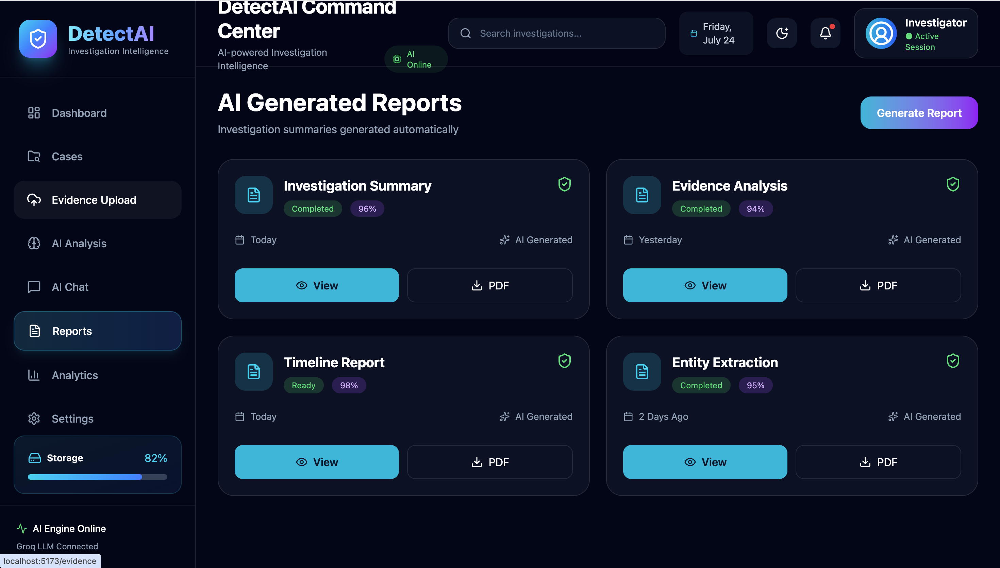

# 🛡️ DetectAI – AI-Powered Investigation Intelligence Platform

> An intelligent digital investigation assistant that helps investigators analyze evidence, extract key entities, generate timelines, produce investigation reports, and interact with evidence using Large Language Models (LLMs).

---

## 📌 Project Overview

DetectAI is a full-stack AI-powered investigation platform designed to assist law enforcement agencies, cybersecurity teams, and digital forensic investigators.

The platform allows investigators to upload evidence documents and automatically generates:

- 📄 Investigation Summary
- 👤 People Extraction
- 🏢 Organization Extraction
- 📍 Location Detection
- 📅 Timeline Generation
- 🔍 Keyword Extraction
- 💡 Investigation Insights
- 🤖 AI Chat with Evidence
- 📑 Downloadable Investigation Report

---

# ✨ Features

### 🔐 Secure Backend
- FastAPI REST API
- Environment variable support
- Secure API key management
- Dockerized backend

---

### 🤖 AI Investigation Engine

Powered by **Groq Llama 3.3**

Capabilities include:

- Evidence summarization
- Entity extraction
- Timeline generation
- Investigation insights
- Context-aware evidence chat

---

### 📁 Evidence Upload

Supports:

- TXT
- PDF

Automatically extracts text and analyzes evidence.

---

### 📊 AI Analysis Dashboard

Displays:

- Investigation Summary
- People
- Organizations
- Locations
- Dates
- Keywords
- Timeline
- Investigation Insights

---

### 💬 Chat with Evidence

Ask questions such as:

> Who transferred the files?

> Which organization is involved?

> What happened on 10 March 2026?

The AI answers only from the uploaded evidence.

---

### 📄 PDF Report

Generate a professional investigation report containing:

- Summary
- Entities
- Timeline
- Insights

---

### 🐳 Docker Support

Complete application containerized using Docker.

---

# 🏗️ System Architecture

```
                +----------------------+
                |      React UI        |
                |  (Vite + TypeScript) |
                +----------+-----------+
                           |
                     HTTP REST API
                           |
                +----------v-----------+
                |      FastAPI         |
                |      Backend         |
                +----------+-----------+
                           |
                   Groq LLM API
                           |
                +----------v-----------+
                |   AI Investigation   |
                |       Engine         |
                +----------------------+
```

---

# 🛠️ Technology Stack

## Frontend

- React
- TypeScript
- Vite
- Tailwind CSS
- React Router
- Axios
- Lucide Icons
- Framer Motion

---

## Backend

- FastAPI
- Python
- Uvicorn
- Groq API
- PyPDF2
- ReportLab
- Pydantic

---

## AI

- Groq API
- Llama 3.3 70B Versatile

---

## DevOps

- Docker
- Docker Compose

---

# 📂 Project Structure

```
DetectAI
│
├── backend
│   ├── app
│   ├── uploads
│   ├── requirements.txt
│   ├── Dockerfile
│   └── .env
│
├── frontend
│   ├── src
│   ├── public
│   ├── package.json
│   └── Dockerfile
│
├── docker-compose.yml
└── README.md
```

---

# 🚀 Installation

## Clone Repository

```bash
git clone https://github.com/YOUR_USERNAME/DetectAI.git

cd DetectAI
```

---

## Backend

```bash
cd backend

python -m venv venv

source venv/bin/activate

pip install -r requirements.txt
```

Create `.env`

```env
GROQ_API_KEY=YOUR_GROQ_API_KEY
```

Run

```bash
uvicorn app.main:app --reload
```

---

## Frontend

```bash
cd frontend

npm install

npm run dev
```

---

# 🐳 Docker

Build

```bash
docker compose build
```

Run

```bash
docker compose up
```

Frontend

```
http://localhost:5173
```

Backend

```
http://localhost:8000/docs
```

---

# 📖 API Endpoints

## Upload Evidence

```
POST /upload
```

---

## AI Analysis

```
POST /ai/analyze
```

---

## AI Streaming

```
POST /ai/stream
```

---

## AI Chat

```
POST /chat
```

---

## Generate Report

```
POST /report
```

---

# 📸 Screenshots

## Login Page



---

## Dashboard



---

## Evidence Upload



---

## AI Analysis



---

## Chat with Evidence



---

## Investigation Report



# 🔒 Security

- API keys stored using environment variables
- No secret keys exposed to frontend
- Backend-only AI communication
- Docker isolated environment

---

# 📈 Future Enhancements

- OCR Support
- Image Evidence Analysis
- Audio Evidence Processing
- Face Recognition
- Evidence Relationship Graph
- Multi-user Authentication
- Case Management System

---

# 👨‍💻 Author

**Yeshika Dhingra**

AI Investigation Intelligence Platform

---

# 📄 License

This project is developed for educational purposes.
